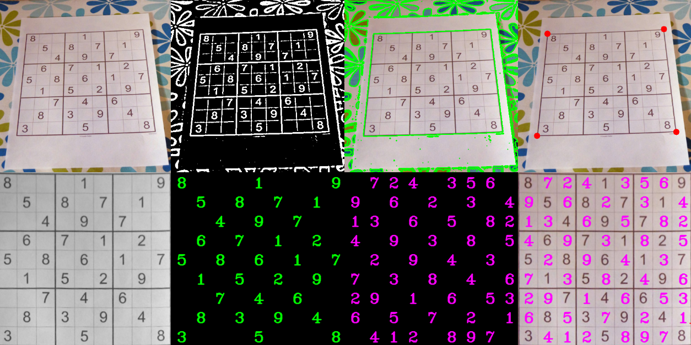

# Sudoku Solver 
The project consists of three phases:

* Process the image with opencv
* Classify the digit with a trained model (Pytorch)
* Solve the sudoku

### Digit classifier
To obtain the numbers of the sudoku, a previously trained CNN was used. 
You can check it in this [repository](https://github.com/HannaLAguilar/Digit_classification)

### Solve sudoku
All the steps are summarized in the following picture:
 

